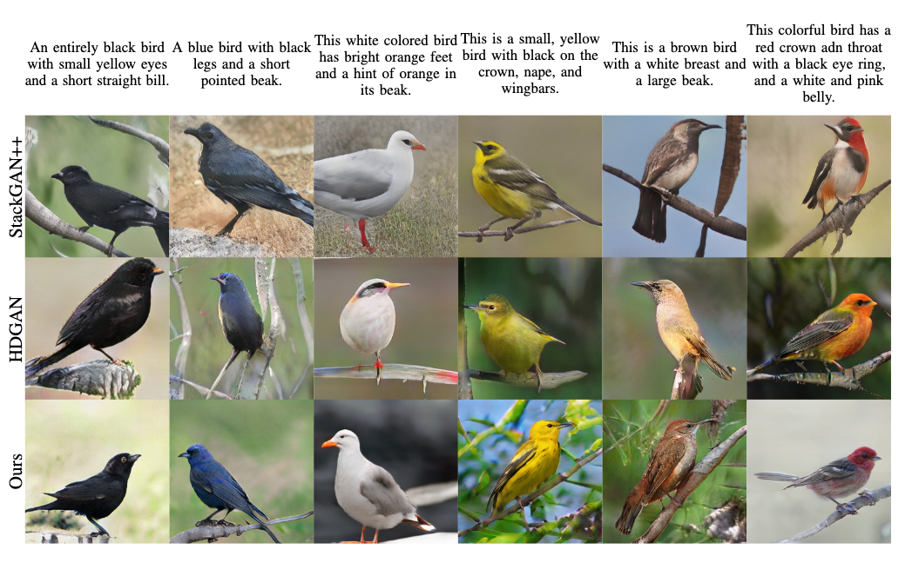

# Efficient T2I
Official implementation of the paper  [Efficient Neural Architecture for Text-to-Image Synthesis](https://arxiv.org/abs/2004.11437).




## Requirements

* Python 3.7+
* Pytorch 1.2+
* Tensorflow 1.14 (`pip install tensorflow-gpu==1.14`) (used to compute IS and FID)
* gdown (`pip install gdown`) (used to download datasets and meta data from Google Drive)
* easydict (`pip install easydict`)
* tensorboardX (`pip install tensorboardx`)
* tqdm (`pip install tqdm`)

## Datasets

To download CUB:
`./scripts/download_birds.sh`

To download Oxford-102:
`./scripts/download_flowers.sh`

## Training

To train:

`./scripts/train_birds.sh`

Please loot at the script for setting training parameters.


## Evaluation

To eval:

`./scripts/eval_cub.sh`

Please loot at the script for setting evaluation parameters.

## Pretrained Models

We already uploaded the pretrained model for Birds, downloads using the provided script:

`./scripts/download_pretrained_birds_model.sh`


## Citation

If you find this work useful, please consider citing:

```tex
@article{souza2020efficient,
  title={Efficient Neural Architecture for Text-to-Image Synthesis},
  author={Souza, Douglas M and Wehrmann, J{\^o}natas and Ruiz, Duncan D},
  journal={arXiv preprint arXiv:2004.11437},
  year={2020}
}
```

